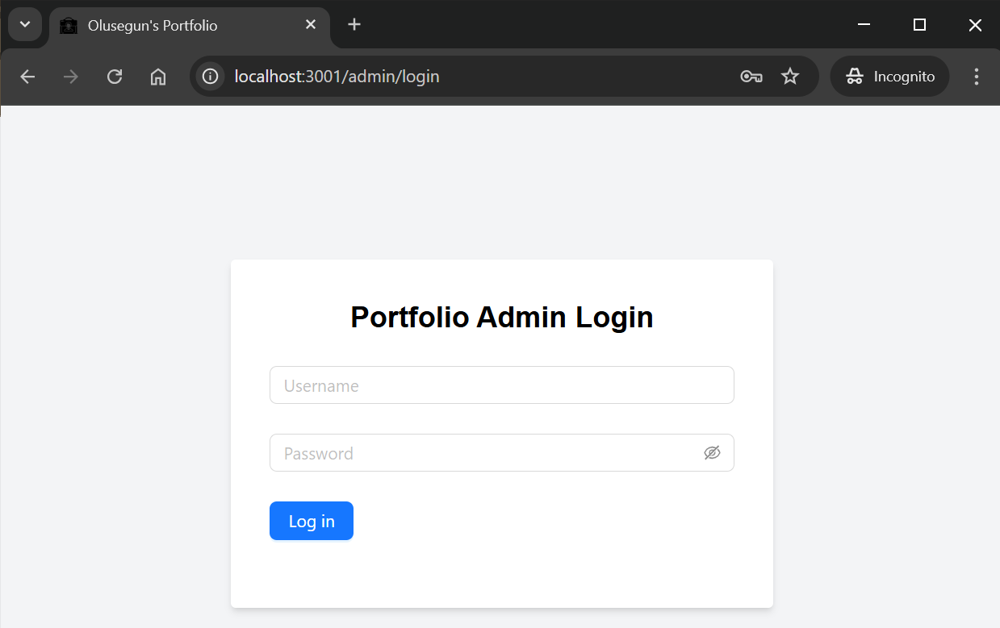
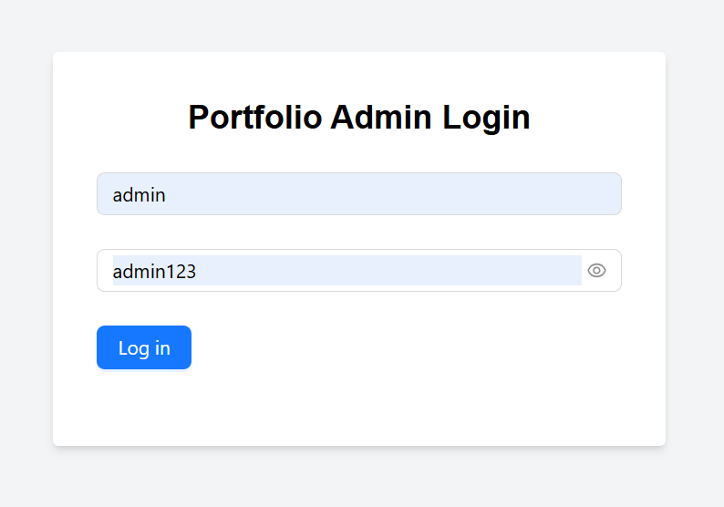
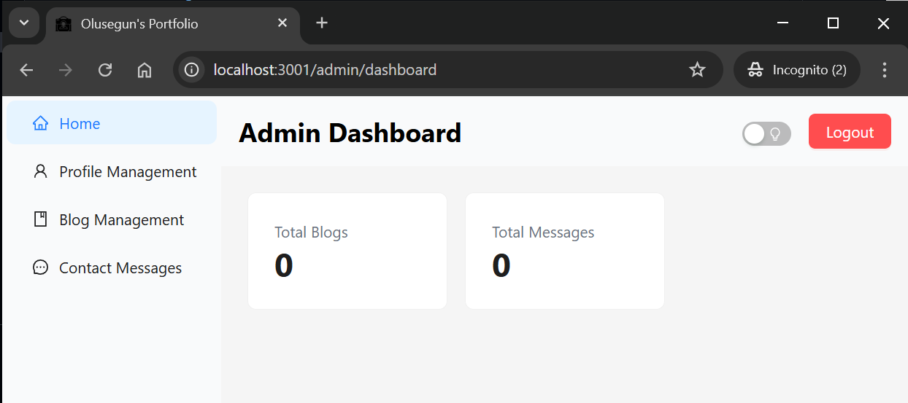
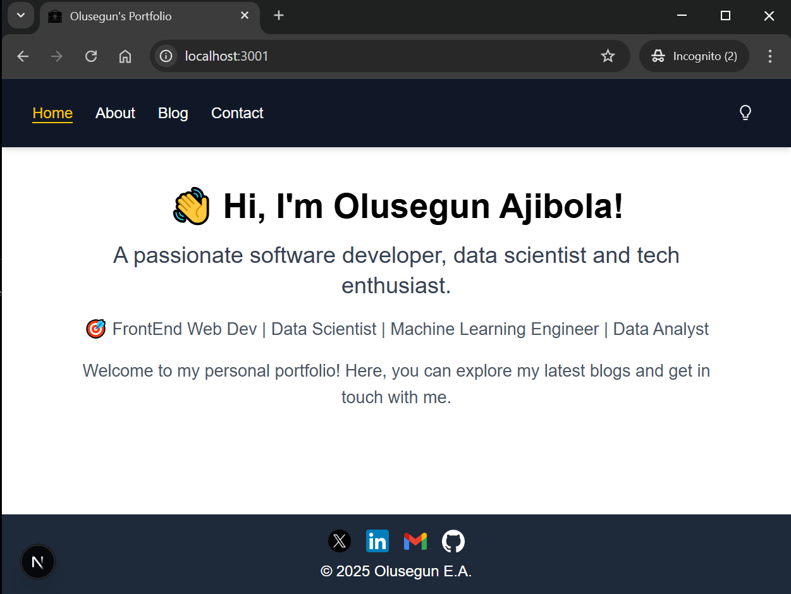

# Portfolio Page with an Admin Dashboard Integration

## Introduction

In this project, a personal portfolio with an admin page is being setup. This fully responsive personal portfolio website is built with Next.js, Tailwind CSS, and Ant Design. This project features an admin panel for managing content and a public-facing interface to showcase the profile, blog posts, and contact information.

The goal is familiarize oneself with the much needed practical knowledge in becoming a frontend web developer.

## Features

- **Admin Dashboard**: Manage profile, blog posts, and view contact messages.
- **Public Interface**: Display profile, blog posts, and a contact form.
- **Dark/Light Mode**: Toggle between dark and light themes.
- **Responsive Design**: Optimized for mobile, tablet, and desktop.
- **Image Uploads**: Upload and display images for profile and blog posts.
- **Social Media Links**: Connect with audience through social media.

## Technologies Used

- **Next.js**: A React framework for building server-side rendered and static web applications.
- **Tailwind CSS**: A utility-first CSS framework for styling.
- **Ant Design**: A design system for enterprise-level products.
- **LocalStorage**: For client-side data persistence.

## Setup and Installation

### Prerequisites

- [Node.js](https://nodejs.org/en) (v14 or later)
- npm (or yarn)

### Installation

1. Clone the repository:

   ```bash
   git clone https://github.com/olusegunajibola/personal-porfolio.git
   cd personal-portfolio
   ```
2. Install dependencies:
    ```bash
    npm install -D tailwindcss postcss autoprefixer
    npx tailwindcss init
    npm install antd
    npm install moment
   ```
   **N.B**:
   Using the below can also create a Next.js app in an instant. This will be done without other necessary dependencies.
   ```bash
   npx create-next-app@latest # install nextjs app in the current folder
   ```
   This would result in the prompt dialogue below: 
   ```bash
   √ What is your project named? ... my-app 
   √ Would you like to use TypeScript? ... No/ Yes # pick no
   √ Would you like to use ESLint? ... No / Yes  # pick yes
   √ Would you like to use Tailwind CSS? ... No / Yes  # pick yes
   √ Would you like your code inside a `src/` directory? ... No / Yes  # pick no
   √ Would you like to use App Router? (recommended) ... No / Yes # pick yes
   √ Would you like to use Turbopack for `next dev`? ... No / Yes # pick yes
   √ Would you like to customize the import alias (`@/*` by default)? ... No / Yes  # pick no
   ```

3. Run the development server:

    ```bash
    npm run dev
    ```
4. Open http://localhost:3000 (or http://localhost:3001 if the default port is active) in your browser to see the application.

## Usage
### Admin Panel
- **Login**: Use the predefined credentials (_username_: `admin`, _password_: `admin123`) to access the admin dashboard.
<figure>
  
  <figcaption>Admin Login.</figcaption>
</figure>
<figure>
  
  <figcaption>Admin Login with Username and Password Input.</figcaption>
</figure>
<figure>
  
  <figcaption>Admin Panel.</figcaption>
</figure>

- **Profile Management**: Update your profile information, including your profile picture.
- **Blog Management**: Create, edit, and delete blog posts.
- **Contact Messages**: View messages submitted through the contact form.

### Public Interface

- **About**: View information about the profile.
- **Blog**: Read blog posts.
- **Contact**: Send a message through the contact form.
<figure>
  
  <figcaption>Public Interface.</figcaption>
</figure>

## Project Structure

- **/app**: Contains the main pages of the application.
- **/components**: Reusable components used across the application.
- **/public**: Static files such as images and logos.

## Deployment with vercel
The project can be easily view via the links below:
- For admin login and dashboard: https://portfolio-sepia-two-79.vercel.app/admin/login
- For frontend: https://portfolio-sepia-two-79.vercel.app/

Now, we will briefly discuss how the two above were made possible.

The first step is to create an account at https://vercel.com/. Connect with your GitHub account.
Via the CLI, run the following:
```bash
npm i -g vercel
vercel --prod
vercel login
vercel # In order to deploy something, run `vercel`.
```

## Contributing
Contributions are welcome! Please follow these steps:

1. Fork the repository.
1. Create a new branch for your feature or bug fix.
1. Make your changes and commit them with descriptive messages.
1. Push your changes to your fork.
1. Submit a pull request to the main repository.

## License
This project is licensed under the MIT License. See the LICENSE file for more information.

## Contact
For questions or feedback, please contact olusegunajibola.e@gmail.com.
